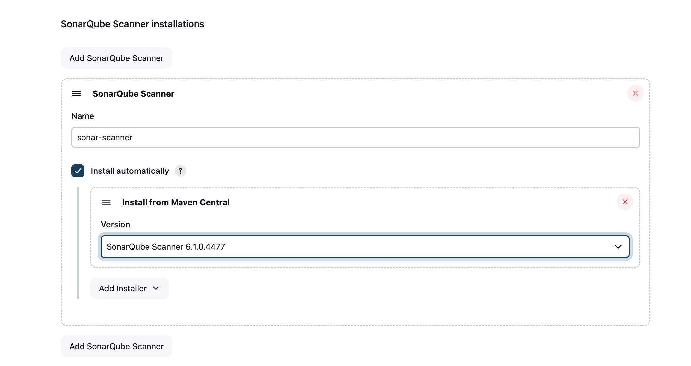

# Code Quality Pipeline [Jenkins & Sonarqube]

- **Task 11: Code Quality Pipeline with Jenkins and SonarQube**
    
    **Objective:**
    
    - Set up a Jenkins pipeline to automate code quality checks using SonarQube, with conditional builds based on the analysis results.
    
    **Steps:**
    
    1. **Jenkins Pipeline Setup**:
        - **Checkout Code**: Start by checking out the latest code from your repository.
    2. **SonarQube Integration**:
        - Run SonarQube for static code analysis.
        - Generate a detailed report on code quality, identifying any issues or vulnerabilities.
    3. **Conditional Build**:
        - Based on the SonarQube report:
            - If the code passes the quality gate (no critical issues), proceed with the build.
            - If the code fails the quality gate, halt the build and send an error notification.
    4. **Slack Notification**:
        - Configure Jenkins to send a notification to a Slack channel, informing the team about the build status and any code quality issues.

# 1. Install Jenkins and Docker on Instance

---

- Running SonarQube in Docker
    - Run a Docker Container of Sonarqube
    
    ```docker
    docker run -d --name sonar-test -p 9000:9000 sonarqube
    
    # this will create a container of sonarqube [port 9000]
    
    # sonarqube have an embedded database 
    # [to store data related to projects (issues,bugs,vulnerability,etc)]
    
    # The embedded database has a lot of limitations. 
    # Be it performance or that you can not migrate it to a newer SonarQube version. 
    # So unless you just want to do a small test, 
    # you have to use a proper database like PostgreSQL.
    ```
    
    ### Config SonarQube [default username = admin , password = admin]
    
                                                               
    
    ---
    
     
    
    - Run Sonarqube with PostgresSQL [Using Docker-compose]
    
    ```yaml
    version: "3"
    
    services:
      sonarqube:
        image: sonarqube
        ports:
          - "9000:9000"
        networks:
          - sonarnet
        environment:
          SONAR_JDBC_URL: jdbc:postgresql://db:5432/sonar
          SONAR_JDBC_USERNAME: sonar
          SONAR_JDBC_PASSWORD: Test12345
        volumes:
          - sonarqube_conf:/opt/sonarqube/conf
          - sonarqube_data:/opt/sonarqube/data
          - sonarqube_extensions:/opt/sonarqube/extensions
    
      db:
        image: postgres
        networks:
          - sonarnet
        environment:
          - POSTGRES_USER=sonar
          - POSTGRES_PASSWORD=Test12345
        volumes:
          - postgresql:/var/lib/postgresql
          
    
    networks:
      sonarnet:
        driver: bridge
    
    volumes:
      sonarqube_conf:
      sonarqube_data:
      sonarqube_extensions:
      postgresql:
      
      
    ```
    
    ### Config SonarQube [default username = admin , password = admin]
    
    ## Install Sonar-Scanner
    

---

- Create a Project in SonarQube[Analysis of code locally in system ]
    1. Login to SonarQube
    2. Create a Local Project
        
        
        
        
        
        
        
        
        
        ## Install Sonar-Scanner And Run Sonar-Scanner
        
        ```yaml
        # Install Directly 
        # Download the Linux sonar-scanner Zip
        # Unzip 
        # Replace the Path 
        { **sonar-scanner** \
          -Dsonar.projectKey=Deployment-Docker-image \
          -Dsonar.sources=. \
          -Dsonar.host.url=http://13.234.76.111:9000 \
          -Dsonar.token=sqp_f342f590270478dd652ce322aa462c83e55afd58
          
          to 
          **path-to-binary/sonar-scanner** \
          -Dsonar.projectKey=Deployment-Docker-image \
          -Dsonar.sources=. \
          -Dsonar.host.url=http://13.234.76.111:9000 \
          -Dsonar.token=sqp_f342f590270478dd652ce322aa462c83e55afd58
        }
          
          
        #Running a SonarQube analysis is straightforward. 
        #You just need to execute the following commands in your project's folder.
        ```
        
        or
        
        ```docker
        #Using Docker 
        
        docker run \
            --rm \
            -v "${YOUR_REPO}:/usr/src" \
            --network="host" \
            -e SONAR_HOST_URL="${SONARQUBE_URL}" \
            -e SONAR_SCANNER_OPTS="-Dsonar.projectKey=${YOUR_PROJECT_KEY}" \
            -e SONAR_TOKEN="${YOUR_TOKEN}" \
            sonarsource/sonar-scanner-cli
         
         # It Should Look like this 
         # run this docker command in the directory you want to run code analysis
        
         docker run \
            --rm \
            -v "$(pwd):/usr/src" \
            --network="host" \
            -e SONAR_HOST_URL="http://52.47.105.88:9000/" \
            -e SONAR_SCANNER_OPTS="-Dsonar.projectKey=deployment-test" \
            -e SONAR_TOKEN="sqa_2eabce2ef53636b9a446731cb77d986f68a27085" \
            sonarsource/sonar-scanner-cli
            
         
        ```
        
        ## After Successful Sonar Analysis
        
        the Sonar-qube Dashboard Should Update And Get the Results of the Analysis
        
        
        

---

- SonarQube Analysis Using Jenkins
    
    
    - Create a Sonarqube token [for Jenkins]
    
    ```docker
    account --> security
    [sqa_11df978c6d29f7b1a188719cff5e7454d20dac14]
    
    ```
    
    - Set Up Jenkins
    
    ```docker
    #install this plugins
    SonarQube Scanner
    Sonar Quality Gates
    Eclipse Temurin installer [jdk]
    ```
    
    ### In manage-jenkins -- tools
    
    config - jdk installations [choose jdk 17]
    
    
    
    ps. select jdk17 
    
    config Sonar-Sonar Scanner 
    
    
    
    ### In manage-jenkins — Credentials [add Sonarqube token]
    
    
    
    ### In manage-jenkins — System [add Sonar-Server]
    
    
    
    ## Write a Pipeline in Jenkins For A Project to Run Code Analysis
    
    ```yaml
    pipeline {
        agent any
        environment {
                     scannerHome = tool 'sonar-scanner' 
                    }
        tools {
                jdk 'jdk17' 
              }
    
        stages {
            stage('Checkout Code') {
                steps {
                    git branch: 'main', url: "https://github.com/Arun2089/jenkins-task2.git"
                }
            }
    
            stage('Sonar Analysis') {
               
                steps {
                    withSonarQubeEnv('sonar-server') { 
                        sh "${scannerHome}/bin/sonar-scanner -Dsonar.projectKey=Deployment-Docker-image "
                    }
                }
            }
         }
       }
    ```
    
    
    
    ### Run the Job
    
    
    
    ```docker
    We can See The Sonarqube-analysis is Executed Successfully 
    and 
    Quality Gate Status Is Also Active 
    [it is featched from sonarqube configured in the jenkins] 
    ```
    

---

- Adding A Conditional Pipeline Using [Quality Gate]
    
    Requirements - 
    
      1. add slack plugin in jenkins configure it  
    
    1. create a pipeline called Deployment [main pipeline which contains the Code That is Analysed ]
    
    This Pipeline will Trigger another Pipeline [Deployment] If The Status of Quality Gate Is ok
    
    and Send a Slack Notification For Success and Failure of the Quality Gate
    
    ```bash
    pipeline {
        agent any
        environment {
                    scannerHome = tool 'sonarqube-scanner' 
                }
        
    
        stages {
            stage('Checkout Code') {
                steps {
                    git branch: 'main', url: "https://github.com/Arun2089/jenkins-task2.git"
                }
            }
    
            stage('Sonar Analysis') {
               
                steps {
                    withSonarQubeEnv('sonarqube-server') { 
                        sh "${scannerHome}/bin/sonar-scanner -Dsonar.projectKey=Deployment-Docker-image"
                    }
                }
            }
    
            stage('Quality Gate') {
                steps {
                    script {
                        def qualityGate = waitForQualityGate()
    
                        if (qualityGate.status == 'OK') {
                            
                            slackSend(channel: 'U07CGJ071V2', color: 'good', message: 'Quality gate passed View report at http://43.204.110.177:9000/dashboard?id=Sonar_qube')
                            build job: 'Deployment', wait: true
                            
                        } else {
                            
                            
                            slackSend(channel: 'U07CGJ071V2', color: 'danger', message: 'Quality gate failed View report at http://43.204.110.177:9000/dashboard?id=Sonar_qube')
                            error "Quality gate failed, aborting pipeline."
                        }
                    }
                }
            }
        }
    }
    
    ```
    

---
